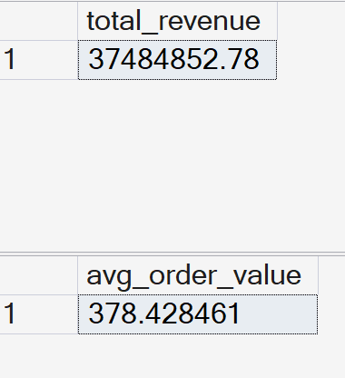
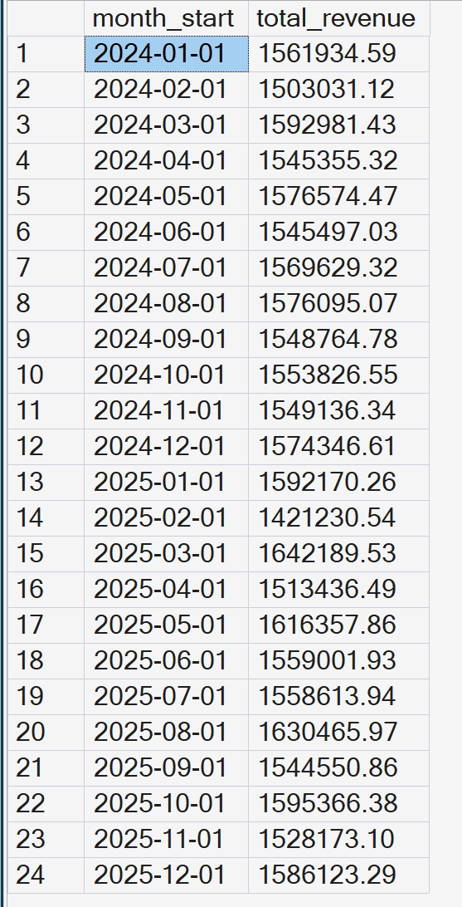
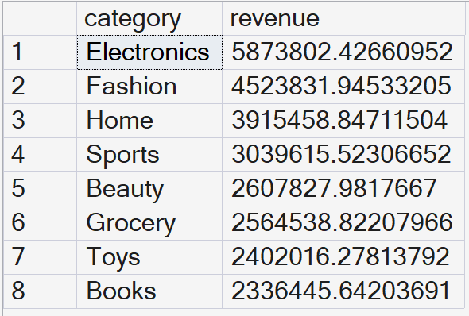
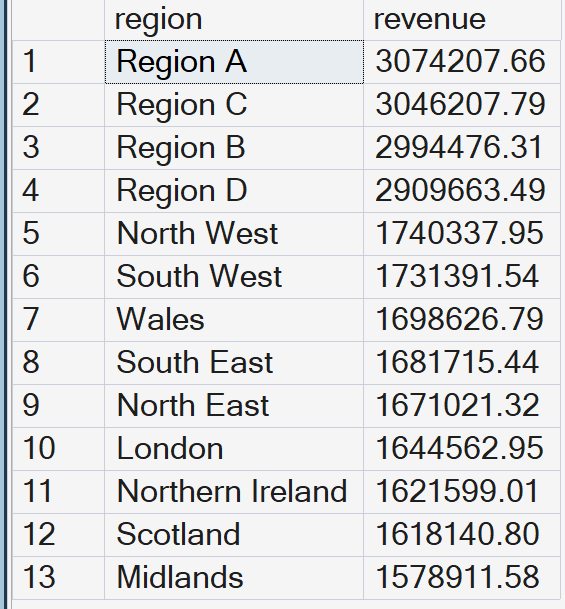

# E-Commerce SQL Analysis Project

## Project Overview
This project shows how SQL can be used to analyse an e-commerce dataset from start to finish.
The main goal is to understand sales performance, customer behaviour, which products matter
most, and any risks in how the business operates.

The work starts with basic checks to make sure the data is accurate. It then looks at key
areas such as sales trends, repeat customers, product performance, and finally provides
practical business recommendations. This reflects the type of analysis data analysts
commonly do in real online retail environments.

---

## Dataset Summary

### Data Source
The dataset used in this project is synthetic and created to resemble a real online shop.
It includes information about customers, orders, purchased products, regions, and payments.

Synthetic datasets like this are often used for learning and portfolio projects, especially
when real company data cannot be shared.

### Dataset Resources
The dataset structure is similar to publicly available e-commerce datasets used for practice,
for example:
- Kaggle – E-commerce & Retail Sample Datasets  
  https://www.kaggle.com/datasets
- Microsoft Learn – Sample Databases & SQL Sample Data  
  https://learn.microsoft.com/en-us/sql/samples/

### Tables Used
The main tables used in the analysis are:
- customers – customer details and location
- orders – order information including dates and totals
- order_items – products within each order, including quantity and price
- products – product details and categories
- payments – payment records and payment dates

---

## Why This Dataset?
This dataset was chosen because it is structured in a similar way to real e-commerce systems.
It allows analysis to move from raw sales data through to meaningful business insights.

Using this dataset makes it possible to:
- Check data quality and consistency
- Track sales and business growth
- Analyse whether customers return after their first purchase
- Understand which products and categories generate the most revenue
- Identify risks such as unpaid orders or late payments

These are common questions data analysts work on in online retail businesses.

---

## Main Analysis Areas
- Ensuring the data is clean and accurate
- Analysing sales and growth over time
- Measuring customer retention using cohort analysis
- Identifying top-performing products using the 80/20 rule
- Tracking month-by-month growth by product category
- Reviewing payment delays and operational risks

---

## Main Findings
- Sales are generally stable, with only small seasonal changes.
- Many customers do not return after their first or second month.
- A small number of products generate most of the revenue (the 80/20 rule).
- Some product categories show steady growth, while others remain flat.
- There are cases of late or missing payments, which could impact cash flow.

---

## Business Recommendations
- Focus on keeping customers engaged after their first purchase.
- Prioritise marketing and stock for top-selling products.
- Invest more in product categories that show consistent growth.
- Use reminders or incentives to encourage on-time payments.
- Regularly review unpaid or split-payment orders as part of routine checks.

---

## Visual Outputs

### KPI Summary

### Monthly Revenue Trend

### Revenue by Product Category

### Revenue by Region

---

## Tools Used
- SQL Server (SSMS) – for querying and analysing the data
- GitHub – for version control and hosting the project

---

## Assumptions & Limitations
- The dataset is synthetic and does not represent a real company.
- All monetary values are assumed to use the same currency.
- Customer behaviour is simplified for analysis purposes.
- Payment data does not include transaction amounts or payment method details.

---

## Outcome
This project demonstrates practical SQL skills combined with business-focused thinking.
It shows how structured data can be analysed to produce clear insights and useful
recommendations, similar to the work done in real data analyst roles.

